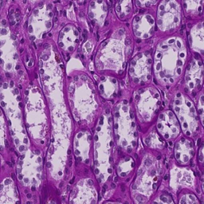
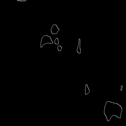
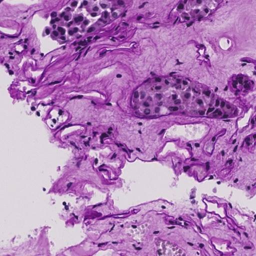
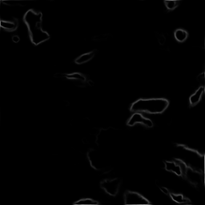

> This code is for the Competition organized on Kaggle [HuBMAP - Hacking the Human Vasculature](https://www.kaggle.com/competitions/hubmap-hacking-the-human-vasculature/overview)

Train Data

Me used U-Net Based model to solve this problem.

Input image

Output Image

> Find data Here [HuBMAP - Hacking the Human Vasculature](https://www.kaggle.com/competitions/hubmap-hacking-the-human-vasculature/data)